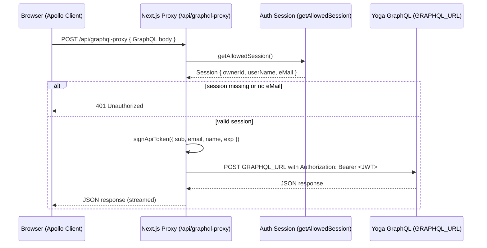

# Authentication & Authorization Flow

This document describes how the **movies-ui** app authenticates a user and authorizes access to the Yoga GraphQL API.

## High-level overview

1. **User signs in** (outside the scope of this doc). A server-side session is established and later read via `getAllowedSession()`.
2. **Apollo Client** sends GraphQL requests **to a Next.js proxy** at `/api/graphql-proxy` (or an override URL) instead of talking to the Yoga server directly.
3. The **proxy verifies the session**. If no allowed session (specifically, no `eMail`) → **401 Unauthorized**.
4. If the session is valid, the proxy **mints a short‑lived API JWT** (Bearer) using `JWT_SECRET` and embeds minimal claims (`sub`, `email`, `name`).
5. The proxy **forwards** the original GraphQL request **to the Yoga server** (`GRAPHQL_URL`) with `Authorization: Bearer <apiToken>`.
6. The Yoga server **validates the JWT** using the same secret and processes the request.

---

## Sequence

---

## Key components

- **Apollo Client setup** `apps/movies-ui/src/lib/apollocient.ts`
  - Uses `createHttpLink` targeting the proxy URL `NEXT_PUBLIC_GRAPHQL_PROXY_URL` (default: `/api/graphql-proxy`).
  - **Browser:** `credentials: "same-origin"` so cookies are sent.
  - **Server (SSR/ISR/Route handlers):** forwards the *incoming* request cookies via `next/headers()` so the proxy can read the session.

- **Proxy route** `apps/movies-ui/src/app/api/graphql-proxy/route.ts`
  - `POST`: validates session, mints JWT, forwards body to `GRAPHQL_URL` with `Authorization: Bearer <token>`.
  - `GET`: convenience endpoint that returns a long-lived token (default 12h) for debugging/tools. Responses are **non-cacheable**. The /api/graphql-proxy GET endpoint also returns a 12‑hour valid token that can be used directly in the Yoga GraphQL Explorer for testing queries.

- **Token signer** `apps/movies-ui/src/lib/graphql-auth.ts`
  - `signApiToken({ sub, email, name, expiresIn })` → HS256 JWT.
  - Claims: `sub` (defaults to `"unknown"` if missing), `email`, `name`.
  - Options: `{ algorithm: "HS256", expiresIn, issuer: "movie-database" }`.

---

## Environment variables

| Name | Required | Where used | Purpose |
| ---- | -------- | ---------- | ------- |
| `JWT_SECRET` | **Yes** | Token signer (`graphql-auth.ts`) & Yoga server | Symmetric key for HS256 signing/verification. Must match between proxy and Yoga. |
| `GRAPHQL_URL` | **Yes** | Proxy route | Absolute URL of the Yoga GraphQL server the proxy forwards to. |
| `NEXT_PUBLIC_GRAPHQL_PROXY_URL` | No (defaults to `/api/graphql-proxy`) | Apollo client | Allows overriding the proxy endpoint (e.g., when deploying the proxy elsewhere). |

> Notes
> - `expiresIn` in `signApiToken` accepts a human time value (e.g., `"15m"`, `"12h"`) or a numeric value. Default in code path is `"15Mins"`; the `GET` endpoint uses `"12H"`.
> - Yoga must validate tokens with the **same `JWT_SECRET`** and expect issuer `movie-database`.

---

## Request flows

### Browser/CSR
- Apollo sends to proxy with cookies automatically (`credentials: same-origin`).
- Proxy reads session, signs JWT, forwards to Yoga with `Authorization: Bearer <token>`.

### Server/SSR
- `apollocient.ts` forwards inbound cookies using `next/headers()` so `getAllowedSession()` can authenticate the user at the proxy.

---

## Error handling
- If `getAllowedSession()` returns no session or missing `eMail` → **401** `{ error: "Unauthorized" }`.
- Upstream Yoga errors are passed through as-is (status code and JSON body).

---

## Security considerations
- **Short‑lived tokens**: Prefer brief expirations for API tokens. The production POST proxy uses short TTL; the GET token (12h) is intended for tooling—avoid exposing it to the browser.
- **No caching**: Proxy responses set headers to prevent caching.
- **Least claims**: Only `sub`, `email`, `name` are included; add roles/claims in `graphql-auth.ts` if required.
- **Cookie boundary**: The browser never sees the `JWT_SECRET`; only the proxy mints tokens.

---

## Local setup checklist
1. Set `JWT_SECRET` in both the proxy environment and Yoga server.
2. Set `GRAPHQL_URL` to your Yoga endpoint (e.g., `http://localhost:4000/graphql`).
3. (Optional) Set `NEXT_PUBLIC_GRAPHQL_PROXY_URL` if the proxy is hosted elsewhere; otherwise leave default.
4. Verify sign‑in works so `getAllowedSession()` returns `{ ownerId, userName, eMail }`.
5. Run a sample query from the UI; check Network → `/api/graphql-proxy` and Yoga receives `Authorization: Bearer <...>`.
